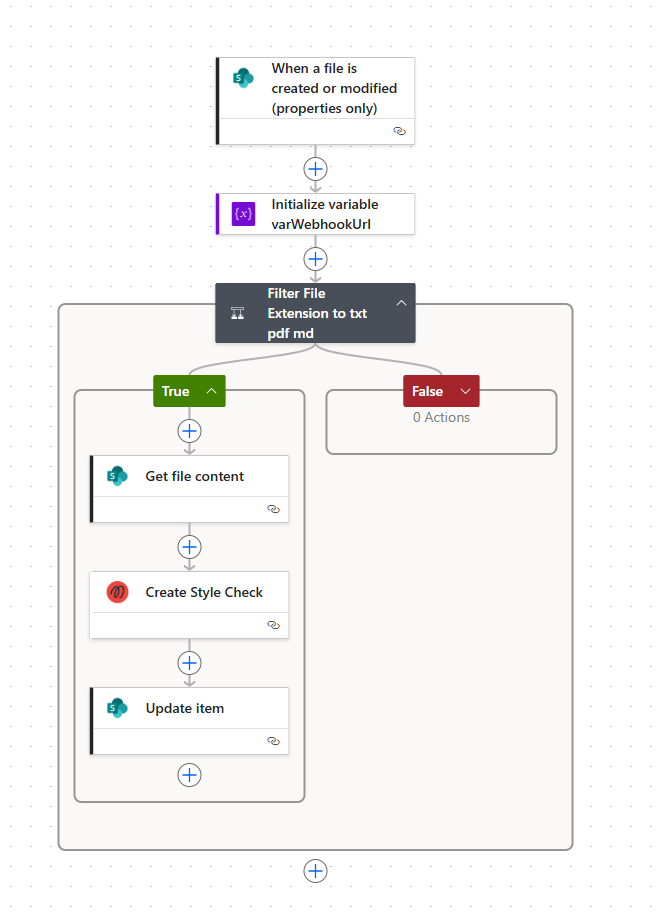
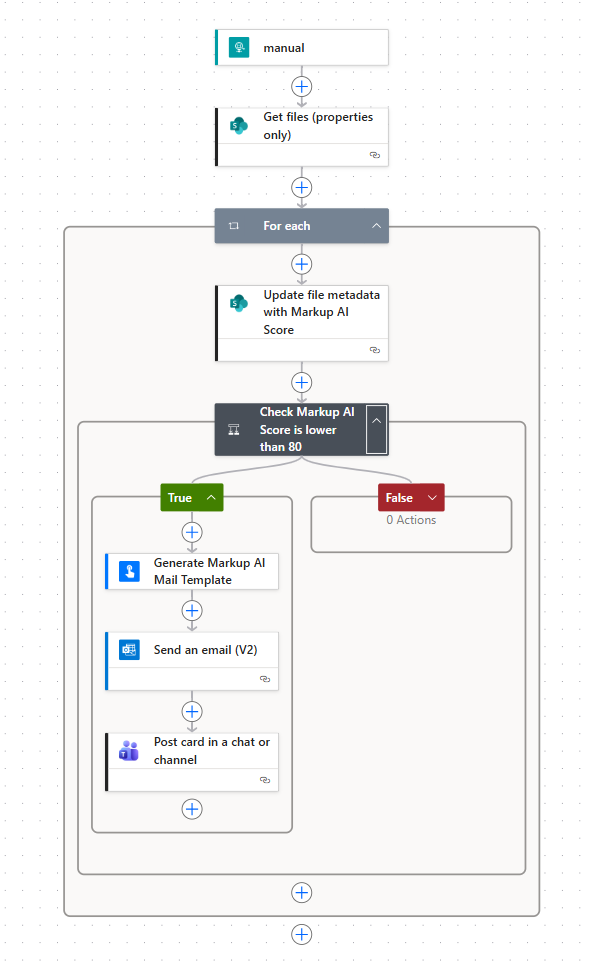

# Automated Content Monitoring with Power Automate for SharePoint and Teams

This guide demonstrates how to create an automated content monitoring workflow using Markup AI. The workflow sends a comprehensive document report to the document owner and posts an adaptive card to a Teams channel.

---

## When to Use This
Use this workflow to monitor and analyze the quality of documents stored in a SharePoint library. It is ideal for ensuring content quality and notifying stakeholders about document analysis results.

---

## Prerequisites

Before you begin, ensure you have the following:

- A Microsoft 365 Subscription
- A Microsoft Teams Team or SharePoint Site with a Document Library
- A basic understanding of Power Automate and its workflow creation
- A valid Markup AI API token. Don't have one yet? [Get Access](https://console.markup.ai/signup)
- This flow uses pre-defined template flows (child flow). Ensure, they have been imported to your Power Automate environment. You can find the package [here](../src/MarkupAIContentMonitoringTools_1_0_0_0.zip)
- Optional: A Microsoft 365 automation account (e.g., `content-monitoring@<your-domain>.com`)

### Extend Your Document Library
Add the following columns to your document library:

| Internal Name         | Title                     | Type                |
|-----------------------|---------------------------|---------------------|
| MarkupAIWorkflowId   | Markup AI - Workflow ID   | Single Line of Text |
| MarkupAIQualityScore | Markup AI - Quality Score | Number              |

---

## Workflow Overview

The content monitoring workflow consists of two flows:

1. **Workflow 1**: Triggered when a file is created or modified in SharePoint.
2. **Workflow 2**: Triggered by a webhook when Markup AI completes the analysis.

---

## Workflow 1: Automated Content Quality Alert for New and Updated SharePoint Files

### Step 1: Power Automate Trigger - `When a file is created or modified (properties only)`

**Introduction**: This step sets up the trigger for the workflow to monitor changes in the SharePoint library.

**App**: SharePoint<br />
**Event**: Automation → Cloud Flow → Automated → When a file is created or modified (properties only)

#### Parameters:
- **Site Address**: Select the Site Address where the document library is stored.
- **Library Name**: Select the library for which you want to create the content monitoring.

#### Settings:
- **Trigger Condition**:
  ```
  @not(equals(triggerOutputs()?['body/Editor']?['Email'], 'content-monitoring@<your-domain>.com'))
  ```
  This ensures the workflow only runs when required, avoiding infinite loops.

---

### Step 2: Initialize Variable `varWebhookUrl`

**Introduction**: This step initializes a variable to store the webhook URL for communication with Markup AI.

**App**: Power Automate (Built-in)<br />
**Action**: Variable → Initialize Variable

#### Parameters:
- **Name**: `varWebhookUrl`
- **Type**: String
- **Value**: Leave blank for now; it will be filled later.

---

### Step 3: Filter File Extension to `txt`, `pdf`, `md`

**Introduction**: This step ensures only relevant file types (txt, pdf, md) are processed by the workflow.

**App**: Power Automate (Built-in)<br />
**Action**: Control → Condition

#### Condition Expression:
- **Or**:
  - `endsWith(triggerBody()?['{FilenameWithExtension}'], '.txt')` is equal to `true`
  - `endsWith(triggerBody()?['{FilenameWithExtension}'], '.pdf')` is equal to `true`
  - `endsWith(triggerBody()?['{FilenameWithExtension}'], '.md')` is equal to `true`

In the `False` block, no action is required. In the `True` block, proceed with the next steps.

---

### Step 4: Get File Content

**Introduction**: This step retrieves the content of the file to be analyzed by Markup AI.

**App**: SharePoint<br />
**Action**: Get file content

#### Parameters:
- **Site Address**: Same as defined in the trigger.
- **File Identifier**: `@{triggerOutputs()?['body/{Identifier}']}`
- **Infer Content Type**: Yes

---

### Step 5: Create the Markup AI Style Check

**Introduction**: This step sends the file content to Markup AI for analysis and style checking.

**App**: Markup AI<br />
**Action**: Create Style Check

#### Parameters:
- **File_upload/body**: `@{body('Get_file_content')}`
- **File_upload (file name)**: `@{triggerBody()?['{FilenameWithExtension}']}`
- **Dialect**: Choose your preferred dialect (e.g., `american_english`)
- **Style Guide**: Choose your preferred style guide (e.g., `microsoft`)
- **Tone**: Choose your preferred tone (e.g., `professional`)
- **Webhook_url**: `@{variables('varWebhookUrl')}`

This action returns a `status` and `workflow_id`. Use the `workflow_id` to attach it to the document.

---

### Step 6: Update File Properties

**Introduction**: This step updates the file metadata in SharePoint with the workflow ID returned by Markup AI.

**App**: SharePoint<br />
**Action**: Update file properties

#### Parameters:
- **Site Address**: Same as defined in the trigger.
- **List Name**: Same as defined in the trigger.
- **Id**: `@{triggerOutputs()?['body/ID']}`
- **Markup AI - Workflow ID**: `@{outputs('Create_Style_Check')?['body/workflow_id']}`

---

### Workflow 1 - When a file is created or modified Complete Design




## Workflow 2: Webhook Receiver for Markup AI Analysis Results

### Step 1: Power Automate Trigger - `When an HTTP request is received`

**Introduction**: This step sets up the webhook to receive analysis results from Markup AI.

**Event**: Automation → Cloud Flow → Instant → When an HTTP request is received

#### Parameters:
- **Who can trigger the flow?**: Anyone
- **Request Body JSON Schema**: Define the schema. Use the schema attached [here](./payload_schema.json)
- **Method**: POST

---

### Step 2: Get Files (Properties Only)

**Introduction**: This step retrieves the file metadata from SharePoint based on the workflow ID.

**App**: SharePoint<br />
**Action**: Get files (properties only)

#### Parameters:
- **Site Address**: Same as Workflow 1.
- **Library Name**: Same as Workflow 1.
- **Filter Query**: `MarkupAIWorkflowID eq '@{triggerBody()?['workflow']?['id']}'`

---

### Step 3: Loop Through Results

**Introduction**: This step loops through the files returned by the previous query to process them individually.

**App**: Power Automate (Built-in)<br />
**Action**: Control → Apply to each

#### Parameters:
- **Select an output from previous steps**: `@{outputs('Get_files_(properties_only)')?['body/value']}`

---

### Step 4: Update File Metadata with Scores

**Introduction**: This step updates the file metadata with the quality scores provided by Markup AI.

**App**: SharePoint<br />
**Action**: Update file properties

#### Parameters:
- **Site Address**: Same as Workflow 1.
- **Library Name**: Same as Workflow 1.
- **Id**: `@{items('For_each')?['ID']}`
- **Markup AI - WorkflowID**: `concat('')` (This is required to reset the workflow ID field)
- **Markup AI - Quality Score**: `@{triggerBody()?['original']?['scores']?['quality']?['score']}`

---

### Step 5: Add Threshold Condition to Notify Document Owner

**Introduction**: This step checks if the quality score is below a defined threshold and triggers notifications if necessary.

**App**: Power Automate (Built-in)<br />
**Action**: Control → Condition

#### Condition:
- `@{triggerBody()?['original']?['scores']?['quality']?['score']}` is less than `80`

In the `False` block, no action is required. In the `True` block, proceed with the next steps.

---

### Step 6: Generate Markup AI Report Template

**Introduction**: This step generates a detailed report and adaptive card based on the analysis results.

**App**: Power Automate (Built-in)<br />
**Action**: Flows → Run a Child Flow

#### Parameters:
- **Child Flow**: `Markup AI - Generate Document Analysis Report HTML`
- **Workflow ID**: `@{triggerBody()?['workflow']?['id']}`
- **Document Title**: `@{items('For_each')?['{Name}']}`
- **Link to Document**: `@{outputs('Update_file_metadata_with_Markup_AI_Score')?['body/{Link}']}`
- **Document Owner**: `@{outputs('Update_file_metadata_with_Markup_AI_Score')?['body/Author/DisplayName']}`

---

### Step 7: Notify Document Owner

**Introduction**: This step sends the analysis report to the document owner via email and posts it to a Teams channel.

#### Send an Email:
**App**: Office 365 Outlook<br />
**Action**: Send an email (V2)

#### Parameters:
- **To**: `@{outputs('Update_file_metadata_with_Markup_AI_Score')?['body/Author/DisplayName']}`
- **Subject**: `Markup AI Analysis Report`
- **Body**: `@{body('Generate_Markup_AI_Mail_Template')?['content']}`

#### Post an Adaptive Card:
**App**: Microsoft Teams<br />
**Action**: Post card in a chat or channel

#### Parameters:
- **Post an**: `Flow bot`
- **Post in**: `Channel`
- **Team**: Select the MS Team (e.g., `Markup AI - Demo`)
- **Channel**: Select the Channel (e.g., `Demo`)
- **Adaptive Card**: `@{body('Generate_Markup_AI_Mail_Template')?['card']}`

---

### Workflow 2 - Webhook Trigger Complete Design




## Combine Workflow 1 and Workflow 2

After publishing Workflow 2 (Webhook), a HTTP URL is created in the trigger. Access the URL by opening the trigger action and copy it. Paste the URL in the `Initialize variable varWebhookUrl` (Workflow 1 → Step 2) value section. Publish Workflow 1 again.

---

## Success - Publish Your Automation Flows!

Test the flow by uploading a new document to the SharePoint library. This flow works in SharePoint and Teams.

---

## No-Code Tips

- **Test Each Step**: Test each step individually to ensure data flows correctly.
- **Rename Each Step**: Use clear names for each step to improve readability.
- **Use Filters**: Filters ensure the flow runs only when specific conditions are met.
- **Dynamic Data**: Leverage data from previous steps to create personalized notifications.
- **Automation Connections**: Use an automation account for read/write access to files.
- **Create Site Columns**: Create reusable site columns with well-formed internal names for Markup AI.